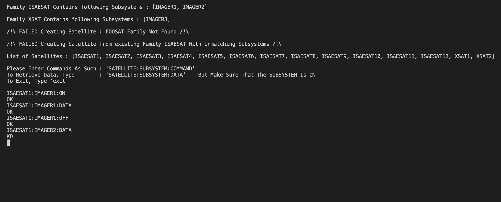
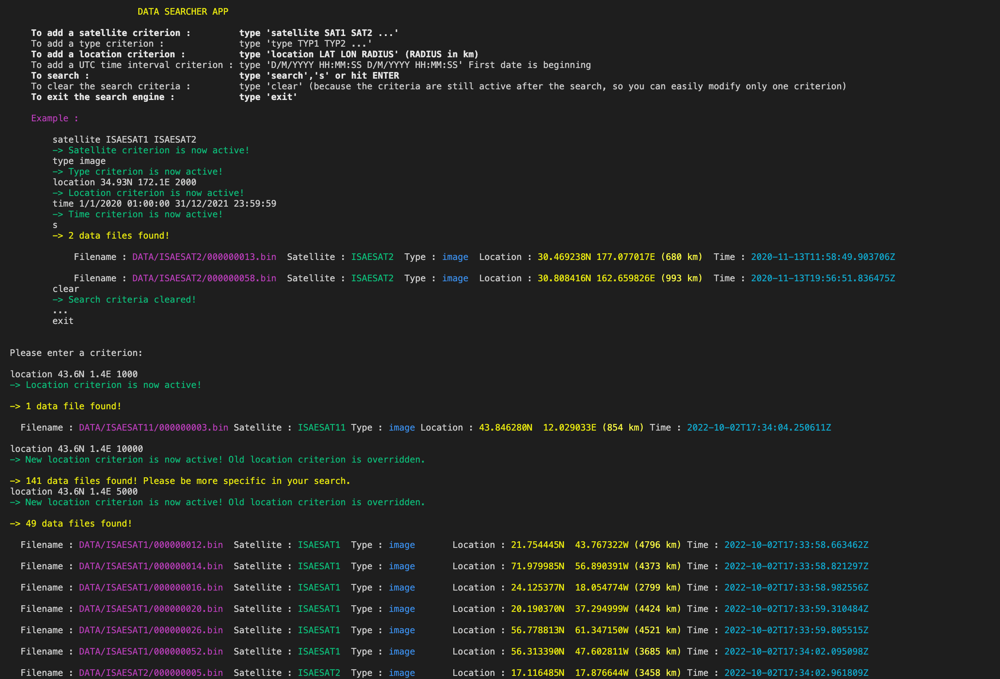

# Satellite-Communication-Project

Satellite Communication Project in Java (school project)

## Base project

The main project idea was to simulate a satellite control center. Each satellite was an independant entity that could communicate with the control center class. Each satellite also had independant subsystems. One can turn on the satellite instruments by specifing the satellite, instrument, and ON/OFF command. Then, one could take a snapshot image by writing DATA (see example below). One had to make sure the instruments were on prior to taking an image.

## Extensions

After the base project, we worked as a group of 4 to make extensions. Each member of the group had his own extension, that had to be implemented in the final group project. As my code was the cleanest (or less messy) and written in english (international students in the group), my code was chosen as base. I wrote an extension to simulate data acquisition that included floats and images. Data had then to be stored on non-volatile memory (i.e. Data had to be saved after program exit). Data needed to be accessed again. Finally, the extension included a search engine.

Thus, the extension featured :

- Data generating
- Data writing
- Data reading
- Data searching

